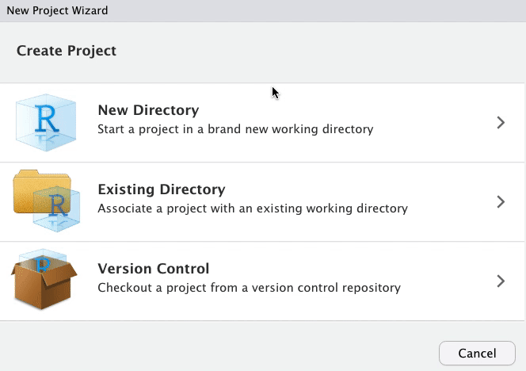
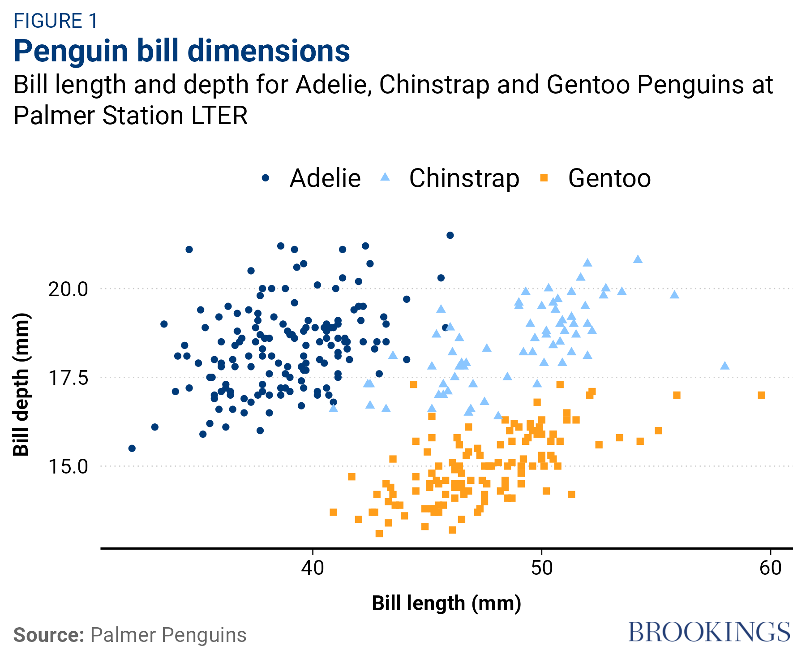

```{r setup, include=FALSE}
library('knitr')
librarian::shelf(tidyverse, ggbrookings, palmerpenguins, magick)
old.hooks <- fansi::set_knit_hooks(knitr::knit_hooks)
options(
  htmltools.dir.version = FALSE,
  htmltools.preserve.raw = FALSE,
  tibble.width = 60,
  tibble.print_min = 6,
  crayon.enabled = TRUE
)
opts_chunk$set(
  echo = TRUE,
  warning = FALSE,
  message = FALSE,
  comment = "#>",
  fig.path = 'figure/',
  cache.path = 'cache/',
  cache = TRUE,
  fig.retina = 3,
  fig.align = 'center',
  fig.show = 'hold',
  dpi = 120,
  eval = FALSE
)
```

```{r xaringan-themer, include=FALSE}
library(xaringanthemer)
style_duo_accent(
  primary_color = "#003A79",
  secondary_color = "#FF9E1B",
  inverse_header_color = "#FAFAFA"
)
```

```{r xaringan-panelset, echo = FALSE}
xaringanExtra::use_panelset()
```

```{r external, include = FALSE, cache = FALSE}
knitr::read_chunk('plots.R')
```

```{css echo=FALSE, eval = TRUE}
.highlight-last-item > ul > li, 
.highlight-last-item > ol > li {
  opacity: 0.5;
}
.highlight-last-item > ul > li:last-of-type,
.highlight-last-item > ol > li:last-of-type {
  opacity: 1;
}
```

## Overview

Writing a package can seem overwhelming at first. So we'll cover the basics to get you started:

+ What is an R package and why you might want to build one
+ Basic package structures and concepts
+ `ggbrookings` walkthrough

???

Even though I use R all the time, I'm relatively new to package development. It seemed really intimidating and complicated. 

One of the reasons I finally decided to power through and learn how to create one is that I was reusing a lot of code to create charts that looked nice on the Brookings website. So I decided to make a package to easily summon my custom themes and color palettes. 

My goal today is to walk you through enough of the basics to get you started and to convince you that you absolutely can make one

---
class: highlight-last-item

## R packages 
> Packages are the fundamental units of reproducible R code. They include reusable R functions, the documentation that describes how to use them, and sample data.  
> - [Hadley Wickham and Jenny Bryan](https://r-pkgs.org/index.html)


In other words, a **package** is a home for *functions*.

--
And **functions** are a home for *source code*. 
???
I.e., functions in R are short-hand for longer source code. 

--

Packages are a way of **describing** and **distributing** these functions, in a structured and consistent way.


---
## R packages

You may already know how to:

- Install them from CRAN
```{r, eval=F}
install.packages("x")
```
???
If you use R you're probably familiar with how to install and load packages from CRAN and access their documentation
--

- Use them in R
```{r, eval = F}
library('x')
```

--

- Get help
```{r, eval = F}
help(package = "x")
```

---

## Why write a package?

+ Code Organization: 

???
Code organization:  I am always trying to figure out where I saved that “function” I wrote months, weeks, or even days ago. Often times, I end up just re-writing it because it is faster than searching all my .R files. An R package would help in organizing where my functions go.
--
+ Consistent documentation: 
???
Documentation: I can barely remember what half of my functions do let alone the inputs and outputs. An R package provides a great way to write consistent documentation
--

+ Code Distribution: 
???
Documentation: I can barely remember what half of my functions do let alone the inputs and outputs. An R package provides a great way to write consistent documentation

--

+ __Anything__ you do repeatedly and want to automate

> As Hilary Parker says in her [introduction to packages](https://hilaryparker.com/2014/04/29/writing-an-r-package-from-scratch/): “Seriously, it doesn’t have to be about sharing your code (although that is an added benefit!). It is about saving yourself **time**.”


---
## Why write a package?

+ Take project-specific input data and clean in a consistent way
+ Create a specific plot/table with your colors, logo, and specific data
+ Generate a recurring report

---

## Setup

We will be using these packages to make our lives easier:


* [`devtools`](https://devtools.r-lib.org/):  

> The aim of devtools is to make package development easier by providing R functions that simplify and expedite common tasks.

???
While creating a package can seem intimidating, the tidyverse team has spent years crafting meta-packages to make life easier to create packages. 

These are used everyday by 1000s of package developers, and really do make the complicated things easier... with functions!

--

* [`usethis`](https://usethis.r-lib.org/)  

> usethis is a workflow package: it automates repetitive tasks that arise during project setup and development, both for R packages and non-package projects.

--

* [`roxygen2`](https://roxygen2.r-lib.org)

> The premise of roxygen2 is simple: describe your functions in comments next to their definitions and roxygen2 will process your source code and comments to produce Rd files in the man/ directory

```{r, eval=F, include = FALSE}
install.packages(c("devtools", # expedite common tasks to simplify package dev
                   "usethis",  # workflow package to automate repetitive tasks
                   "roxygen2"  # Easier documentation
                   ))
```


---
## Lets build a package! 

.large[.pull-left[
You can setup a bare bones package by running `usethis::create_package('mypkg')` or from the RStudio menu


]]

.pull-right[

]

---
## What's in a package?

.xlarge[.left-column[
+ **_Description_** 
]]

.right-column[
<br>
A file with metadata about the package, authors, version, and dependencies.
```
Package: mypkg
Title: What the Package Does (One Line, Title Case)
Version: 0.0.0.9000
Authors@R: 
    person(given = "Manuel",
           family = "Alcala Kovalski",
           role = c("aut", "cre"),
           email = "malcalakovalski@brookings.edu",
           comment = c(ORCID = "YOUR-ORCID-ID"))
Description: What the package does (one paragraph).
License: MIT + file LICENSE
Encoding: UTF-8
LazyData: true
Roxygen: list(markdown = TRUE)
RoxygenNote: 7.1.2
```
]

???

We'll talk more about dependencies soon

---
## What's in a package?

.xlarge[.left-column[
+ Description
+ **_NAMESPACE_** 
]]

.right-column[
<br><br>
+ Lists functions that will be exported by your package
+ Lists functions imported from other packages
+ `{roxygen2}` will take care of this for you!

```{r}
# Generated by roxygen2: do not edit by hand
export(tbl_regression)
export(tbl_summary)
export(tbl_uvregression)
importFrom(glue,glue)
importFrom(knitr,knit_print)
importFrom(magrittr,"%>%")
```
]
---
## What's in a package?

.xlarge[.left-column[
+ Description
+ NAMESPACE
+ _**R folder**_
]]

.right-column[
<br><br><br><br>
+ .xlarge[Your functions go here!]
]

???
Most important, where you'll spend most time.
Often you'll see one code file for each exported function.
You should know that this is just a convention and that you can include more than one function in your .R file.

Personally, I recommend keeping related functions together.
---

## Dependencies 

Usually your package will depend on other packages. You need to convey this so that they are installed. 

???
For your package to work on someone else's computer it'll have to ensure they have all the necessary functions your package relies on.
--

+ Description file specifies:
  + `Imports` - List of packages ___required___ to use your code (these are also added to NAMESPACE).
  + `Suggests` - Packages that are ___not required___ but help (e.g. functions used in a vignette). Not necessary with a local file. 
  
???
There are two types but usually you'll care about your imports.
  
--


__Beware of tidyverse dependencies!__  Hadley's Wickham's advice:  
>Because the tidyverse is a set of packages designed for interactive data analysis, this is, in short, a bad idea. The tidyverse package includes a substantial number of direct and indirect dependencies (79 packages, as of this writing), many of which are likely unnecessary for the purposes of your package. Furthermore, the CRAN maintainers frown upon depending on it, which can cause hassle for you down the line.


---

## Functions

.pull-left[

```{r, eval=F}
usethis::use_r("my_mean")
```
]

.pull-right[
+ Creates a minimal .R file for you to write your function.
+ Places file in the `R` folder
+ Opens it for interactive editing
]

---
## Functions

.pull-left[
Lets create a wrapper function around `mean` which ommits NA's by default.
```{r, eval=F}
usethis::use_r("my_mean")
##✓ Setting active project to '/Users/malcalakovalski/mypkg'
##• Modify 'R/fcount.R'
##• Call `use_test()` to create a matching test file
```
<br>
Write the body of our function:
```{r}
my_mean <- function(x) {
  mean(na.omit(x)) #<<
}
```
]

.pull-right[
+ Creates a new code file for you to write your function.
+ Places file in the `R` folder
+ New file is entirely blank
<br><br><br><br>
🛑 For *EVERY* __non-base__ R function you need to use `::` to reference the function. 
]
---
## Functions

.pull-left[
Lets create a wrapper function around `mean` which ommits NA's by default.
```{r, eval=F}
usethis::use_r("my_mean")
##✓ Setting active project to '/Users/malcalakovalski/mypkg'
##• Modify 'R/fcount.R'
##• Call `use_test()` to create a matching test file
```
<br>
Since `na.omit()` is from the `stats` package, our function should be written as
```{r}
my_mean <- function(x) {
 {{ mean(stats::na.omit(x)) }}
}
```
]

.pull-right[
+ Creates a new code file for you to write your function.
+ Places file in the `R` folder
+ New file is entirely blank
<br><br><br><br>
🛑 For *EVERY* __non-base__ R function you need to use `::` to reference the function. 
]


---

## Functions
Lets add another function that produces a __sorted__ frequency table for a factor. We’ll do this by building on `forcats::fct_count()`.

--
+ First, add the `forcats` package to the __"Imports"__ section of **DESCRIPTION**. 

```{r}
usethis::use_package("forcats")
## ✓ Adding 'forcats' to Imports field in DESCRIPTION
## • Refer to functions with `forcats::fun()`
```

--
+ Next, initiate a new .R file in the `R/` directory with use_r():
```{r}
usethis::use_r("fcount")
```

--
+ Write the body of the function
```{r}
fcount <- function(x) {
  forcats::fct_count(x, sort = TRUE) #<<
}
```

--
+ The last step will be to use `{roxygen2}` comments in our code to document our new function.

---
## Documentation


.pull-left[ Insert a roxygen2 skeleton by placing your cursor inside the function body and either: 
  + Pressing `Ctrl + Alt + Shift + R`  
  + Clicking `Code > Insert roxygen skeleton`.]
  
.pull-right[
  ```{r}
#' Title
#'
#' @param x 
#'
#' @return
#' @export
#'
#' @examples
fcount <- function(x) {
  forcats::fct_count(x, sort = TRUE)
}
```
]

--


+ Roxygen comments appear above a function

--
+ Roxygen items are indicated with special comments (#'), ie:

--
+ Most common tags are:
  + `@param` documents function arguments
  + `@export` tells roxygen to export the function when the package is built
  + `@return` what the function return
---

## Documentation


.pull-left[ Insert a roxygen2 skeleton by placing your cursor inside the function body and either: 
  + Pressing `Ctrl + Alt + Shift + R`  
  + Clicking `Code > Insert roxygen skeleton`.]
  
.pull-right[

.xlarge[**Fill in the template!**]
  ```{r}
#' Make a sorted frequency table for a factor
#'
#' @param x factor
#'
#' @return A tibble
#' @export
#' @examples
#' fcount(iris$Species)
fcount <- function(x) {
  forcats::fct_count(x, sort = TRUE)
}
```
]


+ Roxygen comments appear above a function
+ They always start with `#'`
+ Most common tags are:
  + `@param` documents function arguments
  + `@export` tells roxygen to export the function when the package is built
---

## Documentation

.pull-left[
Now we can document our function:
```{r}
devtools::document() # Ctrl + Shift + D
```

And preview it with

```{r}
?fcount # or help('fcount')
```

]

.pull-right[


]

--

+ This did a lot of work for us!
  + The `man` folder (short for manual) now contains a file called `fcount.Rd`. 
  + The `NAMESPACE` now specifies that the package will export the `fcount` function. 

---

## Using our package

```{r, echo = FALSE, eval=TRUE, message=FALSE}
fcount <- function(x) {
  forcats::fct_count(x, sort = TRUE)
}

iris <- as_tibble(datasets::iris)
```
+ How do we test drive `fcount()`? 
  + If this were a regular R script, we might define `fcount()` in the global workspace by running it outrselves or calling `source("R/fcount.R")`.

--
+ `devtools::load_all()` to the rescue!
  + Places your functions and package in local memory so that you may tinker and confirm its execution

--
  + Basically the equivalent of sourcing all the scripts in your `R/` folder and loading all your data.
  
--
  + Allows you to iterate quickly, which encourages exploration and incremental progress.

--
+ However as soon as you close your R session, the package will no longer be available.

--

Let's test our function!
```{r, eval = TRUE}
#devtools::load_all()
fcount(iris$Species)
```
---

## Checking our package

> We have empirical evidence that our function works. But how can we be sure that all the moving parts of the this new package still work? This may seem silly to check, after such a small addition, but it’s good to establish the habit of checking this often.
--


We can do this with the `check()` function.

--

> `check` automatically builds and checks a source package, using all known best practices
```{r, eval = FALSE}
devtools::check()
```

--
+ **Read the output of the check!** Deal with problems early and often. 
+ It’s just like incremental development of .R and .Rmd files. The longer you go between full checks that everything works, the harder it becomes to pinpoint and solve your problems.
---

## Installing our package

+ We are now ready to install our package `r emo::ji('celebration')`
+ `devtools::install()` will install your package locally when run inside the specific package project.

--
+ Then you can load your package with:
```{r, eval = F}
library('mypkg')
```

--
To share with your colleagues, you should use GitHub or other version control so they can install with `devtools::install_github('your_name/repository)` 
---


## Include Datasets

.pull-left[
+ Including datasets in an R package is easy with `use_data_raw()` and `use_data()`
```{r}
usethis::use_data_raw()
#> ✔ Creating 'data-raw/'
#> ✔ Adding '^data-raw$' to '.Rbuildignore'
#> Next:
#> ● Add data creation scripts 
#>    in 'data-raw/'
#> ● Use `usethis::use_data()` to 
#>    add data to package
```
]

???
Sometimes you might want to include a dataset and the script used to clean it in your package. This makes it easy to share your data and ensure reproducibility. Also, makes it easier to load the same data across projects/scripts without copying and pasting or worrying about file paths.

We're going to start by calling use_data_raw() which sort of like use_r() creates an empty script for us to write the code that cleans our raw data. The end of this file should attach the outputed cleaned data to your package.

--
.pull-right[
- Simulate dataset, and then call `use_data()` to save it with the package
- Save this script in the `data-raw/` folder

```{r}
set.seed(8976) # remeber to set your seed!
my_data <-
  tibble::tibble(
    x = runif(100),
    y = runif(100)
  )
usethis::use_data(my_data, overwrite = TRUE)
#> ✔ Creating 'data/'
#> ✔ Saving 'my_data' to 'data/my_data.rda'
```

]


---
class: center, middle, inverse, title-slide-ggbrookings
# ggbrookings
.xlarge[A ggplot2 extension package which implements the Brookings style guide. It offers several color palettes, a custom theme, and a few helper functions.]

---

## Setup
### Installation

Make sure you have `devtools` installed. If you're using a Windows computer you will also need to install `RTools`.

```{r}
devtools::install_github("BrookingsInstitution/ggbrookings")
```

--

### Fonts

__Roboto__ is Brooking’s main font. You will need to install it by visiting [Google fonts](https://fonts.google.com/specimen/Roboto?query=Roboto) and clicking “Download family”.

Once you’ve done this, unzip and open each of the .ttf files and click install. 

Finaly, run the code chunk below to ensure Roboto is imported and registered:

```{r, eval = F}
ggbrookings::import_roboto()
```


---

## Usage

Currently, the ggbrookings package only has a few simple user facing functions:

--
+ `theme_brookings()` overrides the default ggplot2 theme for a custom one which adheres to the Brookings style guide.

--
+ `scale_color_brookings() `and `scale_fill_brookings()` provide several color palettes that are consistent with the Brookings brand and designed to provide color accessiblity.

--
+ `brookings_view_palette()` is a helper function to see the colors from each palette and extract their hex codes.

--
+ `add_logo()` adds a program/center logo to your plots after saving them. See the vignette on adding logos for more details.

---

## Brookings Theme 
```{r, include = FALSE, eval = TRUE}
librarian::shelf(tidyverse, ggbrookings, palmerpenguins)

theme_set(theme_grey())
```
`theme_brookings()` provides a ggplot2 theme formatted according to the Brookings style guide
.left-code[
```{r plot-last,  eval = TRUE, fig.show = 'hide', fig.height = 4.8, fig.width = 6}

ggplot(data = penguins,
       aes(x = bill_length_mm,
           y = bill_depth_mm,
           group = species,
           color = species,
           shape = species)) +
  geom_point() 
```
]

.right-plot[
`)
]
---

## Brookings Theme

You can call `theme_brookings()` while creating your plot 
.left-code[
```{r brookings-theme,  eval = TRUE, fig.show = 'hide', fig.height = 4.8, fig.width = 6}

ggplot(data = penguins,
       aes(x = bill_length_mm,
           y = bill_depth_mm,
           group = species,
           color = species,
           shape = species)) +
  geom_point() +
{{ theme_brookings() }}
```
]

.right-plot[
`)
]

---


## Brookings Theme

```{r, include=FALSE, eval = TRUE}
#theme_set(theme_brookings())
```


Or set it as the default theme in your session with `theme_set(theme_brookings())`
.left-code[
```{r brookings-theme-set,  eval = TRUE, fig.show = 'hide', fig.height = 4.8, fig.width = 6}

theme_set(theme_brookings()) #<<

ggplot(data = penguins,
       aes(x = bill_length_mm,
           y = bill_depth_mm,
           group = species,
           color = species,
           shape = species)) +
  geom_point() 
```
]

.right-plot[
`)
]


---


## Brookings Theme
.left-long-code[
```{r brookings-theme-title,  eval = TRUE, fig.show = 'hide', fig.height = 5, fig.width = 6}

p <- ggplot(data = penguins,
           aes(x = bill_length_mm,
               y = bill_depth_mm,
               group = species,
               color = species,
               shape = species)) +
      geom_point() +
      labs(title = "Penguin bill dimensions", #<<
       subtitle = "Bill length and depth for Adelie, Chinstrap and Gentoo Penguins at Palmer Station LTER", #<<
       caption = '**Source:** Palmer Penguins', #<<
       tag = 'FIGURE 1', #<<
       x = "Bill length (mm)", #<<
       y = "Bill depth (mm)") #<<

p
```
]


.right-narrow-plot[
`)
]

---


## Scales

`ggbrookings` offers 20  color scales that you can map to your color and fill aesthetics

.left-code[
```{r brookings-main,  eval = TRUE, fig.show = 'hide', fig.height = 4.8, fig.width = 6}
p +
  scale_color_brookings()
```
]

.right-plot[
`)
]

---

## Scales


.left-code[
```{r brookings-brand2,  eval = TRUE, fig.show = 'hide', fig.height = 5, fig.width = 6}

p +
  scale_color_brookings('brand2')
```
]

.right-plot[
`)
]

---

## Scales


.left-code[
```{r brookings-semantic2,  eval = TRUE, fig.show = 'hide', fig.height = 5, fig.width = 6}

p +
  scale_color_brookings('semantic2')
```
]

.right-plot[
`)
]

---

## Scales


.left-code[
```{r brookings-categorical,  eval = TRUE, fig.show = 'hide', fig.height = 5, fig.width = 6}
p + 
   scale_color_brookings('categorical')
```
]

.right-plot[
`)
]

---


## Scales


.left-code[
```{r brookings-misc,  eval = TRUE, fig.show = 'hide', fig.height = 5, fig.width = 6}

p +
  scale_color_brookings('misc')
```
]

.right-plot[
`)
]

---

## View Palette

You can check out all the colors for each palette by running `brookings_view_palette('name_of_palette')`

--
.left-code[
```{r brookings-view-brand1,  eval = TRUE, fig.show = 'hide', fig.height = 4.8, fig.width = 6}
brookings_view_palette('brand1')
```
]

.right-plot[
`)
]

---

## View Palette
.left-code[
```{r brookings-view-brand2,  eval = TRUE, fig.show = 'hide', fig.height = 5, fig.width = 6}

brookings_view_palette('brand2')
```
]

.right-plot[
`)
]

---

## View Palette
.left-code[
```{r brookings-view-semantic2,  eval = TRUE, fig.show = 'hide', fig.height = 5, fig.width = 6}

brookings_view_palette('semantic2')
```
]

.right-plot[
`)
]

---

## View Palette
.left-code[
```{r brookings-view-categorical,  eval = TRUE, fig.show = 'hide', fig.height = 5, fig.width = 6}

brookings_view_palette('categorical')
```
]

.right-plot[
`)
]

---

## View Palette
.left-code[
```{r brookings-view-misc,  eval = TRUE, fig.show = 'hide', fig.height = 5, fig.width = 6}

brookings_view_palette('misc')
```

.large[More examples and information about the palettes can be found in the [Brookings Palettes Vignette](https://brookingsinstitution.github.io/ggbrookings/articles/palettes.html)]
]

.right-plot[
`)
]

--

---

## Add logo


In order to add a logo you should create your plot, save it, and then use `add_logo()`.
The function takes on six arguments:

-   `plot_path`: file path for the plot
-   `logo_path`: which logo to use ('brookings' by default)
-   `logo_position`: 
    Can be 'top left', 'top right', 'bottom left', and 'bottom right'.
-   `logo_scale`: 
    The portion of the plot width the logo should occupy.
-   `height_padding`: 
    Control the y axis position of a logo by specifying the padding proportion.
-   `width_padding`: 
    Control the x axis position of a logo by specifying the padding proportion.
    
.xlarge[Offers 22 center/program logos. Learn more from the [Adding logos vignette](https://brookingsinstitution.github.io/ggbrookings/articles/logos.html)]

---
## Add Logo
.left-long-code[

```{r}
# Plot your chart in R
p + scale_color_brookings() 
# Save it to an image
ggsave("images/penguins.png",  dpi=300, height=5, width=6, units="in", bg = 'white')

# Create image object with a logo
penguins_plot <- 
  add_logo(plot_path = 'images/penguins.png', 
           logo_path = 'brookings',
           logo_scale = 5,
           logo_position = 'bottom right')
# Save it!
image_write(penguins_plot, "images/penguins_logo.png")
```
]


.right-narrow-plot[
```{r, eval = TRUE, echo = FALSE}

```
]

---
class: left, middle, inverse

# Visit the [ggbrookings website](https://brookingsinstitution.github.io/ggbrookings/) or browse the [source code](https://github.com/BrookingsInstitution/ggbrookings/) for more detailed documentation!


---

## Summary

+ What is an R package and why you might want to build one

--
+ Functions

--
+ Documentation

--
+ Dependencies

--
+ Build and check

--
+ Adding data

--
+ `ggbrookings` walkthrough

--

>I hope you feel empowered that you can create your own package, and with many best practices. Ultimately, once you get started you'll quickly see that the tooling has been written to make the process very user friendly.

--

.xlarge[Thank you! `r emo::ji('goodbye')`]
