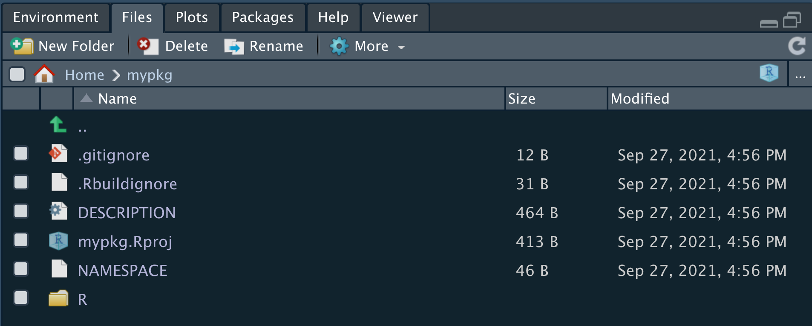
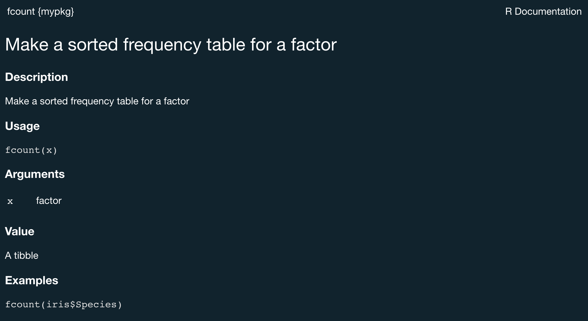

```{r setup, include=FALSE}
library('knitr')
options(htmltools.dir.version = FALSE)
opts_chunk$set(
  echo = TRUE, warning = FALSE, message = FALSE, comment = "#>",
  fig.path = 'figure/', cache.path = 'cache/', cache = TRUE, fig.retina = 3,
  fig.align = 'center', fig.width = 12, fig.height = 8.5, fig.show = 'hold',
  dpi = 120, eval = FALSE
)
```

```{r xaringan-themer, include=FALSE}
library(xaringanthemer)
style_duo_accent(
  primary_color = "#003A79",
  secondary_color = "#FF9E1B",
  inverse_header_color = "#FAFAFA"
)
```

# Overview

    
    

Writing a package can seem overwhelming at first. So we'll cover the basics to get you started:

--

+ What is an R package and why you might want to build one

--
+ Functions

--

+ Basic package structures and concepts

--
+ Documentation

--

+ Dependencies

--

+ Build and check

--
+ `ggbrookings` walkthrough

---

# R packages 
In R, the fundamental unit of shareable code is the package. 

+ What are they?
    + Collections of functions bundled with data, documentation, and tests
    + Purpose is up to the author

--


Most likely, you already know how to

- Install them from CRAN
```{r, eval=F}
install.packages("x")
```

--

- Use them in R
```{r, eval = F}
library('x')
```

--

- Get help
```{r, eval = F}
help(package = "x")
```

---

# Why write a package?

+ Code Organization: 
  + I am always trying to figure out where that “function” I wrote months, weeks, or even days ago. Often times, I end up just re-writing it because it is faster than searching all my .R files. An R package would help in organizing where my functions go.


+ Consistent documentation: 
  + I can barely remember what half of my functions do let alone the inputs and outputs. 
  + An R package provides a great consistent documentation structure and actually encourages you to document your functions.

+ Code Distribution: 
  + No more emailing .R scripts! 
  + An R package gives an easy way to distribute your code for others. Especially if you put it on GitHub.

???
these should be notes
---

# Setup

 We will be using these packages to make our lives easier:
```{r, eval=F}
install.packages(c("devtools", # expedite common tasks to simplify package dev
                   "usethis",  # workflow package to automate repetitive tasks
                   "roxygen2"  # Easier documentation
                   ))
```


---
# Lets build a package! 

.xlarge[.pull-left[
You can setup a bare bones package by running:

```{r}
usethis::create_package("mypkg")
```
]]

.pull-right[

]
--


---

# Package Structure: Requirements

.xlarge[.pull-left[
+ **_Description:_** 
]]

.pull-right[

####A file with metadata about the package, authors, and dependencies.


```

Package: mypkg
Title: What the Package Does (One Line, Title Case)
Version: 0.0.0.9000
Authors@R: 
    person(given = "Manuel",
           family = "Alcala Kovalski",
           role = c("aut", "cre"),
           email = "malcalakovalski@brookings.edu",
           comment = c(ORCID = "YOUR-ORCID-ID"))
Description: What the package does (one paragraph).
License: MIT + file LICENSE
Encoding: UTF-8
LazyData: true
Roxygen: list(markdown = TRUE)
RoxygenNote: 7.1.2
```
]

---
# Package Structure: Requirements

.xlarge[.pull-left[
+ __Description__<br><br>
+ **_NAMESPACE_** 
]]

.pull-right[
+ A short-hand file so R can understand what functions and dependencies to import.

+ Lists functions that will be exported by your package

+ Lists functions imported from other packages

+ `{roxygen2}` will take care of this for you!

```{r}
# Generated by roxygen2: do not edit by hand
export(tbl_regression)
export(tbl_summary)
export(tbl_uvregression)
importFrom(glue,glue)
importFrom(knitr,knit_print)
importFrom(magrittr,"%>%")
```
]
---
# Package Structure: Requirements

.xlarge[.pull-left[
+ __Description__ <br><br>
+ __NAMESPACE__ <br><br>
+ _**R code folder**_
]]

.pull-right[
+ Your functions go here!

+ Often you'll see one code file for each exported function.

+ You can include more than one function in your .R file.

+ I recommend keeping related functions together.
  
]
---

# Package structure: Optional
.xlarge[.pull-left[
+ _**Help files**_ 
]]

.pull-right[
+ Documentation for your functions.

+ Written in a syntax similar to LaTex

+ More common to generate them using the package documentation tool `{roxygen2}`.
]

---

# Package structure: Optional
.xlarge[.pull-left[
+ __Help files__<br><br> 
+ _**Vignettes**_ 
]]

.pull-right[
+ Worked examples of how to use your functions. 

+ Usually writen in `Rmarkdown`. 

+ Create them with
```{r}
usethis::use_vignette("my_vignette")
```

]

---

# Dependencies 

Usually your package will depend on other packages. You need to convey this so that they are installed. 
--

+ Description file specifies:
  + `Imports` - List of packages ___required___ to use your code (these are also added to NAMESPACE).
  + `Suggests` - Packages that are ___not required___ but help (e.g. functions used in a vignette). Not necessary with a local file. 
  
--

For further reading, I suggest Jim Hester's post: https://www.tidyverse.org/blog/2019/05/itdepends/
--


__Beware of tidyverse dependencies!__  Hadley's Wickham's advice:  

>Because the tidyverse is a set of packages designed for interactive data analysis, this is, in short, a bad idea. The tidyverse package includes a substantial number of direct and indirect dependencies (79 packages, as of this writing), many of which are likely unnecessary for the purposes of your package. Furthermore, the CRAN maintainers frown upon depending on it, which can cause hassle for you down the line.
---
# Functions

```{r, eval=F}
usethis::use_r()
```

+ Creates a new code file for you to write your function.

--

+ Places file in the `R` folder
--

+ New file is entirely blank

--

For example, 
```{r}
usethis::use_r("my_mean")
```

--

__Note:__ You can include more than one function in your .R file, I recommend keeping related functions together.


---
# Functions
Let's write our first function

```{r}
my_mean <- function(x) {
  mean(na.omit(x))
}
```

--

+ For EVERY non-base R function you need to use `::` to reference the function. 

--

+ Since `na.omit()` is from the `stats` package, our function should be written as

```{r}
my_mean <- function(x) {
  mean(stats::na.omit(x))
}
```

--


---

# Functions

Lets add another function that produces a __sorted__ frequency table for a factor. 

--

We’ll do this by building on `forcats::fct_count()`.

--

+ First, add the forcats package to the "Imports" section of DESCRIPTION. 

```{r}
usethis::use_package("forcats")
```

--
+ Next, initiate a new .R file in the `R/` directory with use_r():
```{r}
usethis::use_r("fcount")
```

--

+ Write the body of the function
```{r}
fcount <- function(x) {
  forcats::fct_count(x, sort = TRUE)
}
```

--
+ The last step will be to use `{roxygen2}` comments in our code to document our new function.
---
# Documentation

- R function help files (*.Rd) are saved in the `man` (manual pages) folder created by `usethis::create_package()`

--
+ The code in *.Rd is similar to LaTex which can be verbose and cumbersome.

--

.pull-left[
+ Fortunately, we can automate their creation with `{roxygen2}` comments. There's no need for you to learn how to write them yourself.

]

.pull-right[
```{r}
usethis::use_roxygen_md()
```
]

---
# Documentation

The premise of `roxygen2` is to describe your functions in comments next to their definitions and `roxygen2` will process your source code and comments to create `.Rd` files in the `man/` directory
+ Roxygen comments appear above a function

--
+ They always start with `#'`

--

+ Most common tags are
  + `@param` documents function arguments
  + `@export` tells roxygen to export the function when the package is built

---
# Documentation

+ Insert a roxygen2 skeleton by placing your cursor inside the function body and either 

--
  + Pressing `Ctrl + Alt + Shift + R`  

--
  + Clicking `Code > Insert roxygen skeleton`. 

--

.pull-left[
+ Now we can document our function:
```{r}
#' Make a sorted frequency table for a factor
#'
#' @param x factor
#'
#' @return A tibble
#' @export
#' @examples
#' fcount(iris$Species)
fcount <- function(x) {
  forcats::fct_count(x, sort = TRUE)
}
```
]
.pull-right[

]

--

+ Finally, we can convert our roxygen comment into `man/fcount.Rd` with `devtools::document()` or with `Ctrl + Shift + D`.

--

+ You should now be able to preview your help file with
```{r, eval = F}
?fcount
```

---

# Include Datasets

.pull-left[
+ Including datasets in an R package is easy with `use_data_raw()` and `use_data()`
```{r}
usethis::use_data_raw()
#> ✔ Creating 'data-raw/'
#> ✔ Adding '^data-raw$' to '.Rbuildignore'
#> Next:
#> ● Add data creation scripts 
#>    in 'data-raw/'
#> ● Use `usethis::use_data()` to 
#>    add data to package
```
]
--
.pull-right[
- Simulate dataset, and `use_data()` will save it with the package

- Save this script is the `data-raw/` folder

```{r}
set.seed(8976) # remeber to set your seed!
my_data <-
  tibble::tibble(
    x = runif(100),
    y = runif(100)
  )
usethis::use_data(my_data, overwrite = TRUE)
#> ✔ Creating 'data/'
#> ✔ Saving 'my_data' to 'data/my_data.rda'
```

]

---

# How do we actually install and use our package?

+ How do we test drive `fcount()`? 

+ If this were a regular R script, we might define fcount() in the global workspace by running it outrselves or calling `source("R/fcount.R")`.

--

+ `devtools::load_all()` to the rescue!

  + Loads your R package into memory exposing the functions and data we created earlier. 

--

  + Basically the equivalent of sourcing all the scripts in your `R/` folder and loading all your data.
  
--

  + Allows you to iterate quickly, which encourages exploration and incremental progress.

--

+ However as soon as you close your R session, the package will no longer be available.

---
# How do we actually install and use our package?

+ To actually install your package, you use the `devtools::install()` function which installs your R package into your R system library.

+ Then you can load your package with:
```{r, eval = F}
library('mypkg')
```

--

+ Before installing you should check that all the moving parts of your package will work using `devtools::check()`.

+ **Read the output of the check!** Deal with problems early and often. 

+ It’s just like incremental development of .R and .Rmd files. The longer you go between full checks that everything works, the harder it becomes to pinpoint and solve your problems.

---
class: center, middle, inverse, title-slide
# ggbrookings

---

# Overview

`ggbrookings` is a `ggplot2` extension which implements the Brookings style guide. It offers several color palettes, a custom theme, and a few helper functions.


.pull-left[Make sure you have `devtools` installed. 

If you're using a Windows computer you will also need to install `RTools`.]


.pull-right[

```{r}
devtools::install_github("BrookingsInstitution/ggbrookings")
```

]
---
# Setup
### Installation

Make sure you have `devtools` installed. If you're using a Windows computer you will also need to install `RTools`.

```{r}
devtools::install_github("BrookingsInstitution/ggbrookings")
```

### Fonts

__Roboto__ is Brooking’s main font. You will need to install it by visiting [Google fonts](https://fonts.google.com/specimen/Roboto?query=Roboto) and clicking “Download family”.

Once you’ve done this, unzip and open each of the .ttf files and click install. 

Finaly, run the code chunk below to ensure Roboto is imported and registered:

```{r, eval = F}
ggbrookings::import_roboto()
```


---

# Usage

Currently, the ggbrookings package only has a few simple user facing functions:

--

+ `theme_brookings()` overrides the default ggplot2 theme for a custom one which adheres to the Brookings style guide.

--

+ `scale_color_brookings() `and `scale_fill_brookings()` provide several color palettes that are consistent with the Brookings brand and designed to provide color accessiblity.

--

+ `brookings_view_palette()` is a helper function to see the colors from each palette and extract their hex codes.

--

+ `add_logo()` adds a program/center logo to your plots after saving them. See the vignette on adding logos for more details.

---

# Examples

